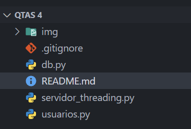

# Laboratorio 4: implementación de sockets con Python

## Universidad Jorge Tadeo Lozano - Facultad de Ingeniería

### Asignatura: Sistemas Distribuidos

## Tabla de Contenidos

1. [Descripción General](#descripción-general)
2. [Estructura del Proyecto](#estructura-del-proyecto)
   - [Base de Datos](#base-de-datos)
3. [Ejecución](#ejecución)
4. [Créditos](#créditos)

### Descripción General

Este laboratorio tiene como objetivo desarrollar una aplicación de chat en línea utilizando Python, SQLite y manejo de sockets. El sistema permite a los usuarios registrarse, iniciar sesión, enviar mensajes a otros usuarios y recibir mensajes en tiempo real. El servidor maneja múltiples clientes de forma simultánea utilizando `threading`.

### Estructura del Proyecto

El proyecto está dividido en tres archivos principales:

- `db.py`: Encargado de la gestión de la base de datos SQLite, con funciones para registrar usuarios, autenticar usuarios, insertar mensajes y recuperar mensajes.
- `servidor_threading.py`: Implementa el servidor de chat que acepta múltiples conexiones de clientes y permite la transmisión de mensajes entre ellos.
- `usuarios.py`: Código del cliente que permite a los usuarios conectarse al servidor, iniciar sesión, registrarse y enviar mensajes.

#### Base de Datos

El archivo `db.py` maneja la creación de la base de datos `chat.db` y contiene las siguientes funciones principales:

- `create_db()`: Inicializa la base de datos y crea las tablas `users` (para los usuarios registrados) y `messages` (para almacenar los mensajes enviados).
- `register_user(name, username, password)`: Permite registrar un nuevo usuario en la base de datos.
- `authenticate_user(username, password)`: Autentica las credenciales de un usuario al iniciar sesión.
- `insert_message(user_id, message)`: Inserta un nuevo mensaje enviado por un usuario en la base de datos.
- `get_messages()`: Recupera todos los mensajes almacenados junto con el nombre del remitente.

#### Servidor

El servidor, implementado en el archivo `servidor_threading.py`, se encarga de manejar múltiples conexiones de clientes de manera concurrente mediante hilos. Los principales aspectos son:

- Maneja la autenticación de usuarios y permite a los nuevos usuarios registrarse.
- Difunde los mensajes de un cliente a todos los demás usuarios conectados.
- Utiliza `threading.Lock` para asegurar el acceso seguro a la lista de clientes.

#### Cliente

El archivo `usuarios.py` implementa el cliente del chat. Los usuarios pueden:

- Iniciar sesión o registrarse en el sistema.
- Enviar y recibir mensajes del servidor.
- Escuchar continuamente los mensajes de otros usuarios a través de un hilo independiente.

### Flujo de Trabajo

1. **Registro/Iniciar Sesión:** Los usuarios pueden registrarse en el sistema o iniciar sesión si ya tienen una cuenta.
2. **Envio de Mensajes:** Los usuarios pueden enviar mensajes que son almacenados en la base de datos y luego enviados a todos los demás usuarios conectados.
3. **Recepción de Mensajes:** Los clientes escuchan continuamente los mensajes provenientes del servidor y los muestran en la consola.

### Ejecución

Antes de iniciar el proyecto, la estructura del mismo se vería de la siguiente forma:

Una vez confirmada la estructura, sigue los siguientes pasos para ejecutar el proyecto.

#### Iniciar el Servidor

Para comenzar con el chat, primero debes iniciar el servidor, que manejará las conexiones de los clientes. Sigue estos pasos:

1. Abre una terminal en el directorio donde se encuentran los archivos del proyecto.
2. Ejecuta el siguiente comando para iniciar el servidor:

```bash
  python servidor_threading.py
```

Esto inicializará el servidor de chat y lo dejará en modo de espera para que los clientes se conecten. El servidor estará escuchando en `localhost` (127.0.0.1) en el puerto `8000`

Verás un mensaje en la consola que indica que el servidor está en funcionamiento:

```plaintext
  Servidor escuchando en 127.0.0.1:8000
```


Además, cuando inicies el servidor por primera vez, se creará automáticamente la base de datos `chat.db` si esta no existe. La base de datos incluye las tablas necesarias para almacenar la información de los usuarios y los mensajes.


#### Ejecutar el Cliente

Una vez que el servidor esté en funcionamiento, es necesario conectar uno o más clientes para interactuar en el chat. Sigue estos pasos para iniciar un cliente:

#### Conectar el Cliente

1. Abre una nueva terminal (diferente a la que ejecuta el servidor) en el mismo directorio del proyecto.
2. Ejecuta el siguiente comando para iniciar el cliente:

```bash
  python usuarios.py
```

##### Registrar un nuevo Usuario

Cuando el cliente esté conectado, verás el siguiente mensaje en la consola:

```plaintext
  ¿Deseas (1) Iniciar sesión o (2) Registrarte?:
```

1. Escribe `2` y presiona Enter para registrarte.

2. Ingresa tu nombre completo, nombre de usuario y contraseña cuando te lo solicite:

```plaintext
  Ingrese su nombre completo:
  Ingrese su nombre de usuario:
  Ingrese su contraseña:
```

3. Si el nombre de usuario no existe en la base de datos, verás el siguiente mensaje:

```plaintext
  Registro exitoso. Bienvenido [Nombre]!
```


4. Ahora puedes enviar y recibir mensajes como cualquier otro usuario registrado.

##### Registro con un usuario ya existente

Si intentas registrarte con un nombre de usuario que ya está en la base de datos, verás este mensaje:

```plaintext
  Nombre de usuario ya existe. Intenta con otro nombre de usuario.
```


#### Iniciar Sesión

##### Con credenciales Correctas

1. Escribe `1` y presiona Enter para iniciar sesión.

2. Ingresa tu nombre de usuario y contraseña cuando te lo solicite:

```plaintext
  Ingrese su nombre de usuario:
  Ingrese su contraseña:
```

3. Si las credenciales son correctas, verás un mensaje de bienvenida como este:

```plaintext
  Bienvenido [Nombre]!
```


Ahora puedes comenzar a enviar y recibir mensajes.

##### Con credenciales incorrectas

1. Escribe `1` para iniciar sesión.

2. Ingresa un nombre de usuario y contraseña incorrectos.

3. Si las credenciales son incorrectas, verás el siguiente mensaje:

```plaintext
  Credenciales incorrectas, intente nuevamente.
```


Repite el proceso hasta que ingreses las credenciales correctas o decidas registrarte.

#### Salir del Chat

Para desconectarte del chat y cerrar la conexión con el servidor:

1. Escribe `salir` y presiona Enter. Esto cerrará la sesión y desconectará el cliente del servidor.

```plaintext
  Usuario [username] se ha desconectado.
```

El servidor también recibirá esta notificación, y el cliente será eliminado de la lista de usuarios conectados.

## Créditos

### Desarrollado por

- **Yarely Vanessa Castillo Melo** - Estudiante de Ingeniería de Sistemas, Universidad Jorge Tadeo Lozano
- **Juan Camilo Tique Ducuara** - Estudiante de Ingeniería de Sistemas, Universidad Jorge Tadeo Lozano

### Herramientas Utilizadas

- **Python** - Lenguaje de programación utilizado para el desarrollo de los scripts.
- **CMD de Windows** - Terminal de comandos utilizada para la ejecución de los scripts.
- **SQLite** - Sistema de base de datos utilizado para el almacenamiento de mensajes y usuarios.
